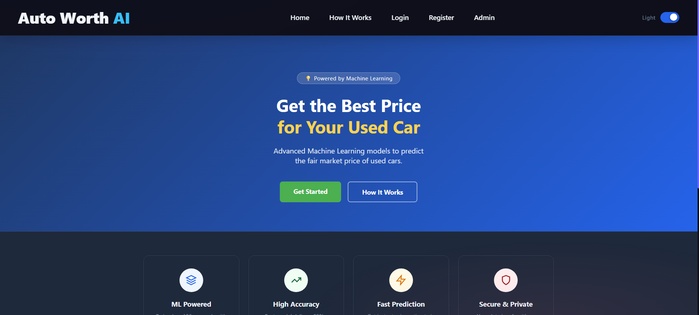
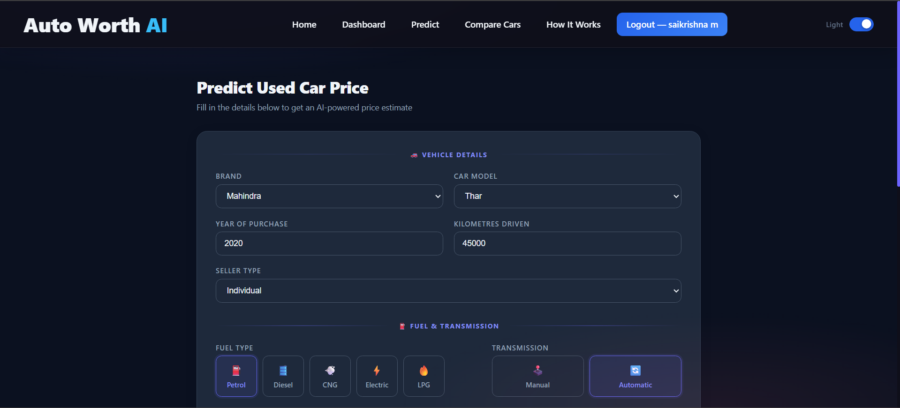
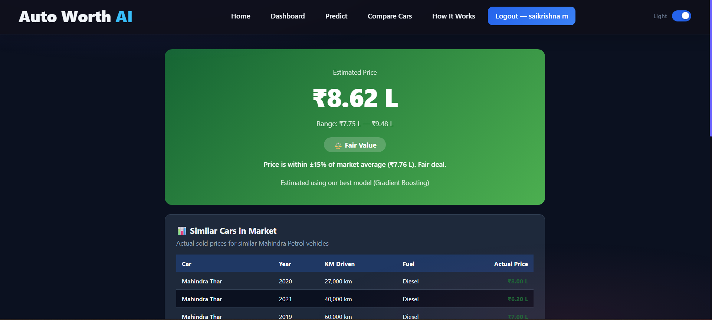
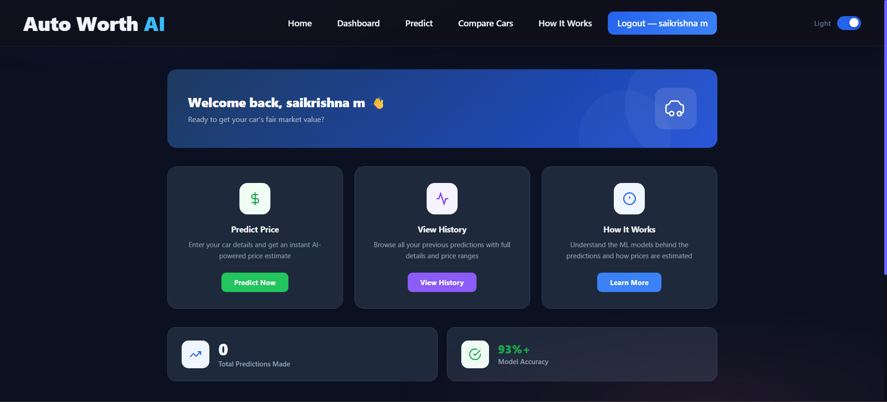
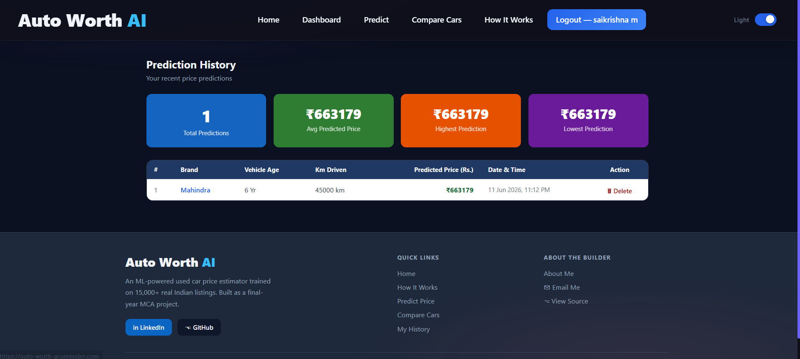
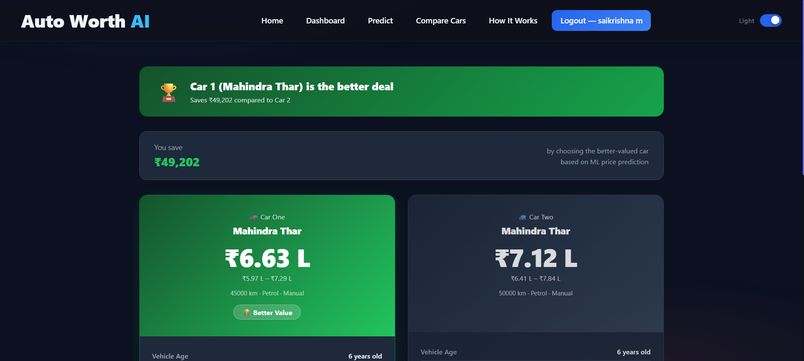
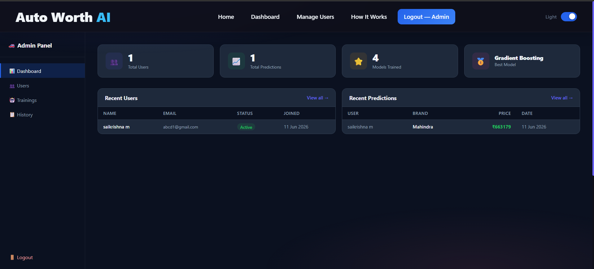

#  Auto Worth AI — Used Car Price Prediction
<p align="center">
  
</p>
> An end-to-end Machine Learning web application that predicts the fair market price of used cars in India using real CarDekho listings data.


--
## 🌐 Live Demo

🔗 https://auto-worth-ai.onrender.com

## 📂 Source Code

🔗 https://github.com/SaikrishnaMangalaprthi/Used_Car_Price_Prediction_Using_ML

## 📌 Overview

Auto Worth AI is a full-stack Django web application built as a final-year MCA project. It trains multiple regression models on 15,000+ real used car listings and serves instant price predictions through a clean, dark-themed UI. Users can predict car prices, compare two cars side-by-side, view prediction history, and explore the underlying dataset.

---

## ✨ Features

| Feature | Description |
|---|---|
| 🔮 **Price Prediction** | Predicts used car selling price with a ±10% confidence range |
| ⚖️ **Market Comparison** | Tags predictions as Affordable / Fair Value / Expensive vs. real market data |
| 🔁 **Car Comparison** | Side-by-side price comparison of any two cars |
| 📊 **Model Training** | Admin can retrain all 5 ML models from the dashboard and view performance charts |
| 📋 **Prediction History** | Users can view, paginate, and delete their past predictions |
| 🗄️ **Dataset Explorer** | Browse the full 15K+ CarDekho dataset in-app |
| 🌗 **Dark / Light Mode** | Persistent theme toggle across all pages |
| 🔐 **Auth System** | Session-based login with admin activation flow |

---

## 🧠 ML Pipeline

### Dataset
- **Source:** CarDekho India listings
- **Size:** 15,411 records × 14 features
- **Brands covered:** 32 Indian & international car brands

### Features Used
```
vehicle_age, km_driven, fuel_type, transmission_type,
seller_type, brand, car_model, mileage, engine, max_power, seats
```

### Models Trained & Results

| Model | R² Score | MAE (₹) | RMSE (₹) |
|---|---|---|---|
| Linear Regression | 0.7057 | 2,07,868 | 3,37,480 |
| Ridge Regression | 0.7057 | 2,07,858 | 3,37,477 |
| Lasso Regression | 0.7057 | 2,07,867 | 3,37,480 |
| Random Forest | 0.9260 | 91,823 | 1,69,171 |
| **Gradient Boosting** ✅ | **0.9381** | **87,829** | **1,54,806** |

**Best Model: Gradient Boosting** — R² of **93.81%**, meaning the model explains 93.81% of variance in used car prices.

### Pipeline Steps
1. Data cleaning & feature engineering (`vehicle_age` from purchase year)
2. Label encoding for categorical features (fuel, transmission, brand, model)
3. Standard scaling
4. Train/test split (80/20)
5. Model serialization with `joblib` (`.pkl` files)

---

## 🏗️ Tech Stack

**Backend**
- Python 3.11
- Django 4.2
- PostgreSQL
- scikit-learn, XGBoost, pandas, numpy, matplotlib, seaborn

**Frontend**
- HTML5, CSS3 (pure CSS, no framework)
- JavaScript (vanilla)
- Dark theme throughout

**Deployment**
- Render (Web Service)
- Gunicorn WSGI server
- WhiteNoise for static file serving

---

## 📁 Project Structure

```
used_car_project/
│
├── admins/                  # Admin app (login, dashboard, user management)
├── users/                   # User app (prediction, history, compare, auth)
├── ml_pipeline/             # ML logic
│   ├── preprocess.py        # Data cleaning & feature engineering
│   ├── train.py             # Model training
│   └── predict.py           # Inference + similar cars + price tag
├── models/                  # Serialized .pkl files (best model, scaler, encoders)
├── dataset/                 # cardekho_dataset.csv
├── templates/               # All Django HTML templates
├── static/                  # CSS, JS, images
├── vehicle_value_prediction/ # Django project settings, urls, wsgi
├── requirements.txt
├── render.yaml
└── manage.py
```

---

## 🏗 System Architecture

Dataset
↓
Feature Engineering
↓
Model Training
↓
Saved .pkl Models
↓
Django Backend
↓
Prediction Engine
↓
User Interface
## 🚀 Running Locally

### Prerequisites
- Python 3.11+
- Git

### Setup

```bash
# 1. Clone the repo
git clone https://github.com/SaikrishnaMangalaprthi/Used_Car_Price_Prediction_Using_ML.git
cd Used_Car_Price_Prediction_Using_ML

# 2. Create virtual environment
python -m venv venv
venv\Scripts\activate        # Windows
# source venv/bin/activate   # macOS/Linux

# 3. Install dependencies
pip install -r requirements.txt

# 4. Apply migrations
python manage.py migrate

# 5. Run the server
python manage.py runserver
```

Open `http://127.0.0.1:8000` in your browser.

### Admin Credentials (local)
Set `ADMIN_USERNAME` and `ADMIN_PASSWORD` in your `settings.py` or as environment variables.

---

## ⚙️ Environment Variables (Production)

| Variable | Description |
|---|---|
| `SECRET_KEY` | Django secret key |
| `DEBUG` | `False` in production |
| `ALLOWED_HOSTS` | Comma-separated allowed hostnames |
| `PYTHON_VERSION` | `3.11.9` |

---

## 📸 Screenshots

### 🏠 Home Page


---

### 🔮 Prediction Form



---

### 📈 Prediction Result



---

### 🏡 User Dashboard



---

### 📜 Prediction History



---

### ⚖️ Car Comparison



---

### 🔐 Admin Dashboard



## 📊 Model Performance Visualization

After training, the admin dashboard displays:
- **R² and MAE bar charts** comparing all 5 models
- **Feature importance** plot (for tree-based models)
- **Actual vs Predicted** scatter plot

---

## 🔮 Future Enhancements

- REST API with Django REST Framework
- Password reset through email
- Recommendation system
- Docker containerization
- Automated model retraining
- CI/CD with GitHub Actions
---

## 👨‍💻 Author

**Mangalaparthi Sai Krishna**
Final Year MCA — University Post Graduate College, Secunderabad (Osmania University)

[](https://linkedin.com/in/mangalaparthi-sai-krishna)
[](https://github.com/SaikrishnaMangalaprthi/)

---

## 📄 License

This project is built for academic purposes as a final-year MCA project submission.

---

*Built with ❤️ using Django + scikit-learn | Deployed on Render*
